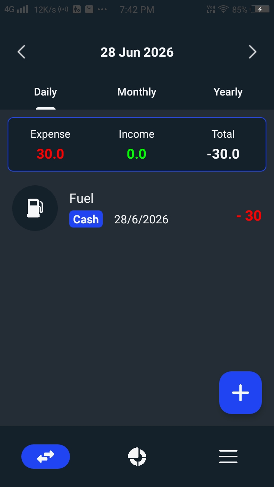
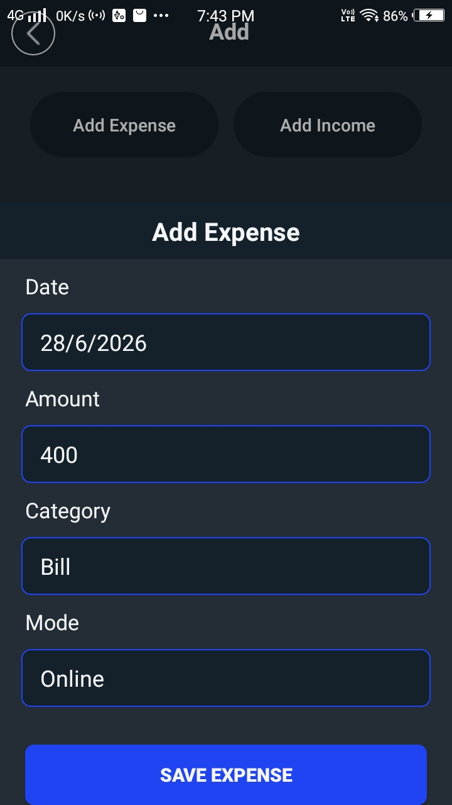
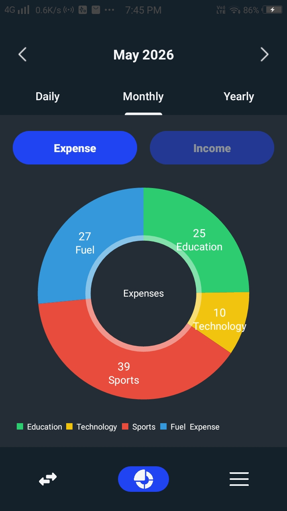

# 💰 Rupee Tracker

<p align="center">
  
  
  
  
</p>

A modern **Personal Finance Management Android Application** built with **Kotlin** that helps users efficiently track income, expenses, and spending habits through beautiful visualizations and an intuitive user interface.

---

## 📱 Screenshots


| Home                      | Add Transaction                      |
| ------------------------- | ------------------------------------ |
|  |  |

| Statistics                 |
| -------------------------- |
|  |

---

# ✨ Features

### 💵 Income & Expense Tracking

* Add income and expense records quickly.
* Edit and delete transactions.
* Store transaction amount, date, category, payment mode, and notes.

### 📂 Smart Categorization

* Organize transactions into categories such as:

  * Food
  * Shopping
  * Travel
  * Entertainment
  * Health
  * Bills
  * Education
  * Others

### 📅 Advanced Filtering

* Filter transactions by:

  * Day
  * Month
  * Year

### 📊 Financial Dashboard

* Total Income
* Total Expenses
* Current Balance
* Recent Transactions

### 📈 Spending Analytics

* Interactive Pie Charts
* Category-wise expense distribution
* Income vs Expense comparison

### 💳 Payment Modes

* Cash
* Online
* UPI
* Card

### 🌙 Theme Support

* Light Mode
* Dark Mode

### 📱 Offline First

* Works completely offline.
* All data is securely stored locally using Realm Database.

---

# 🏗️ App Architecture

```
Presentation Layer
│
├── Activities
├── Fragments
├── Bottom Sheets
│
Business Logic
│
├── Repository
├── Adapters
│
Data Layer
│
├── Realm Database
├── Transaction Model
```

---

# 📂 Project Structure

```
app/
│
├── activities/
│   ├── MainActivity.kt
│   └── AddActivity.kt
│
├── fragments/
│   ├── TransactionFragment.kt
│   ├── StatsFragment.kt
│   └── MoreFragment.kt
│
├── bottomsheet/
│   ├── AddExpenseSheet.kt
│   └── AddIncomeSheet.kt
│
├── adapter/
│   ├── TransactionAdapter.kt
│   └── CategoryAdapter.kt
│
├── model/
│   └── TransactionModel.kt
│
├── repository/
│   └── TransactionRepository.kt
│
└── res/
    ├── layout/
    ├── drawable/
    └── values/
```

---

# 🛠 Tech Stack

| Technology       | Usage               |
| ---------------- | ------------------- |
| Kotlin           | Android Development |
| Realm Kotlin     | Local Database      |
| AndroidX         | UI Components       |
| Material Design  | Modern UI           |
| RecyclerView     | Transaction List    |
| ConstraintLayout | Responsive Layout   |
| MPAndroidChart   | Charts & Analytics  |

---

# 📊 Database

The application uses **Realm Database** for:

* Local Storage
* Fast Read/Write Operations
* Offline Access
* Secure Data Persistence

---

# 🚀 Getting Started

### Clone Repository

```bash
git clone https://github.com/rishicharhate/rupee-tracker.git
```

### Open Project

Open the project in **Android Studio**.

### Sync Dependencies

Allow Gradle to download all required dependencies.

### Run

Run the project on:

* Android Emulator
* Physical Android Device

---

# 📈 Future Enhancements

* Firebase Cloud Backup
* Multi-Currency Support
* Budget Planning
* Savings Goals
* PDF & Excel Report Export
* Recurring Transactions
* Monthly Financial Reports
* Notification Reminders
* Expense Predictions using AI

---

# 🤝 Contributing

Contributions are welcome!

1. Fork the repository
2. Create a feature branch
3. Commit your changes
4. Push the branch
5. Open a Pull Request

---

# 📄 License

This project is licensed under the MIT License.

---

# 👨‍💻 Developer

**Rishi Charhate**

GitHub: https://github.com/rishicharhate

If you found this project helpful, don't forget to ⭐ the repository!
